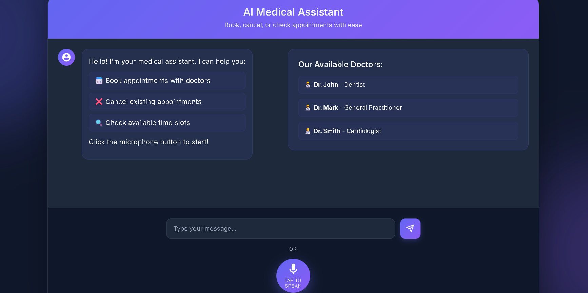

# LyRise Voice Agent - Complete Implementation Guide

## 🖼️ User Interface



---

## 📋 Table of Contents
- [Overview](#overview)
- [Project Structure](#project-structure)
- [Technologies & Approaches](#technologies--approaches)
- [Setup Prerequisites](#setup-prerequisites)
- [Implementation Details](#implementation-details)
- [How to Run Each Version](#how-to-run-each-version)
- [API Keys & Credentials Setup](#api-keys--credentials-setup)

---

## 🎯 Overview

LyRise Voice Agent is a comprehensive voice-based appointment booking system for medical clinics. The project implements **4 different approaches** combining two speech recognition methods with two backend processing methods.

### Core Features
- Voice-based appointment booking
- Doctor schedule management
- Slot availability checking
- Google Calendar integration
- Multi-turn conversational flow
- Session management
- Excel/Database schedule storage

---

## 📁 Project Structure

```
LyRise_Agent/
├── web_speech_api_version/          # Browser-based speech recognition
│   ├── dialogflow_version/          # Using Google Dialogflow for NLU
│   └── llm_version/                 # Using LLM (Ollama/OpenAI) for NLU
└── whisper_version/                 # Server-side speech recognition
    ├── dialogflow_version/          # Using Google Dialogflow for NLU
    └── llm_version/                 # Using LLM (Ollama/OpenAI) for NLU
```

Each version contains:
- `app.py` - Flask backend server
- `services/` - Business logic handlers
- `static/` - Frontend assets (CSS, JavaScript)
- `templates/` - HTML templates
- `database/` - Schedule storage (SQLite + Excel)
- `credentials/` - API credentials (not committed)
- `.env` - Environment configuration

---

## 🔧 Technologies & Approaches

### Speech Recognition Methods

#### 1. **Web Speech API** (Browser-based)
The Web Speech API is a browser-native JavaScript API that provides speech recognition and synthesis capabilities.

**How it works:**
- Runs entirely in the browser (client-side)
- Uses the browser's built-in speech recognition engine
- Chrome uses Google's speech recognition service
- Real-time streaming recognition

**Advantages:**
- No server-side processing needed
- Zero cost (free)
- Low latency
- Easy to implement

**Limitations:**
- Chrome/Edge only (limited browser support)
- Requires internet connection
- Less customizable
- Privacy concerns (data sent to Google)

**Implementation:**
```javascript
const recognition = new webkitSpeechRecognition();
recognition.continuous = false;
recognition.interimResults = false;
recognition.lang = 'en-US';
recognition.start();
```

#### 2. **Whisper API** (Server-based)
Whisper is OpenAI's state-of-the-art speech recognition model, accessed via Groq's API for faster processing.

**How it works:**
- Audio recorded in browser using MediaRecorder API
- Audio blob sent to Flask backend
- Backend calls Groq's Whisper API for transcription
- Text returned to frontend

**Advantages:**
- Superior accuracy
- Works on all browsers
- More control over audio processing
- Supports multiple languages
- Can work offline (with local Whisper)

**Limitations:**
- Requires API key (Groq)
- Server processing overhead
- Slightly higher latency

**Implementation:**
- Frontend: MediaRecorder API captures audio
- Backend: Groq Whisper API (`whisper-large-v3`)
- TTS: gTTS (Google Text-to-Speech) for voice responses

---

### Backend Processing Methods

#### 1. **Dialogflow** (Google's NLU Platform)
Dialogflow is Google Cloud's natural language understanding platform for building conversational interfaces.

**What is Dialogflow:**
- Cloud-based conversational AI platform
- Pre-trained NLU models
- Intent and entity recognition
- Multi-turn conversation support
- Context management
- Webhook integration

**How it works:**
1. User speaks/types a message
2. Text sent to Dialogflow API
3. Dialogflow identifies intent (e.g., "Book Schedule", "Check Availability")
4. Extracts entities (doctor name, date, time)
5. Returns structured response
6. Backend processes the intent and entities

**Key Concepts:**
- **Intents**: User's intention (e.g., book appointment, check schedule)
- **Entities**: Data to extract (e.g., @doctor, @date-time)
- **Contexts**: Maintain conversation state
- **Fulfillment**: Webhook for custom logic

**Advantages:**
- Robust NLU out-of-the-box
- Handles complex conversations
- Multi-language support
- Easy to train with examples
- Built-in entity recognition

**Limitations:**
- Requires Google Cloud setup
- Learning curve for configuration
- Costs for high usage
- Less flexible than custom LLM

#### 2. **LLM** (Large Language Models)
Uses local (Ollama) or cloud (OpenAI) LLMs for natural language understanding and response generation.

**How it works:**
1. User message sent to LLM with system prompt
2. LLM analyzes intent and extracts information
3. Returns structured JSON response
4. Backend processes the response

**Supported LLMs:**
- **Ollama** (Local): llama3.2, mistral, etc.
- **OpenAI** (Cloud): GPT-3.5, GPT-5

**Advantages:**
- More flexible and customizable
- Can run locally (Ollama)
- Better context understanding
- Easier to modify behavior
- No platform lock-in

**Limitations:**
- Requires more prompt engineering
- Local models need GPU/RAM
- OpenAI has API costs
- May need fine-tuning for accuracy

---

## 🚀 Setup Prerequisites

### 1. Python Environment
```bash
# Python 3.8 or higher required
python --version
```

### 2. Install Dependencies
Navigate to the specific version directory and install:
```bash
pip install -r requirements.txt
```

### 3. Database Setup
Each version includes a database initialization script, update its path in the .env file.


---

## 🔑 API Keys & Credentials Setup

### Google Cloud Setup (for Dialogflow versions)

#### Step 1: Create Google Cloud Project
1. Go to [Google Cloud Console](https://console.cloud.google.com/)
2. Click "New Project"
3. Name it (e.g., "LyRise-Voice-Agent")
4. Note the Project ID

#### Step 2: Enable Dialogflow API
1. In Cloud Console, go to "APIs & Services" > "Library"
2. Search for "Dialogflow API"
3. Click "Enable"

#### Step 3: Create Service Account
1. Go to "IAM & Admin" > "Service Accounts"
2. Click "Create Service Account"
3. Name: "dialogflow-agent"
4. Role: "Dialogflow API Client"
5. Click "Create Key" > JSON
6. Save as `credentials/dialogflow-credentials.json`

#### Step 4: Create Dialogflow Agent
1. Go to [Dialogflow Console](https://dialogflow.cloud.google.com/)
2. Create new agent
3. Set language to English
4. Link to your Google Cloud project

#### Step 5: Configure Intents
Create these intents in Dialogflow:

**Intent: Book Schedule**
- Training phrases:
  - "book appointment with @doctor on @date-time"
  - "schedule appointment with @doctor"
  - "I want to book @doctor"
- Parameters:
  - doctor (optional)
  - date-time (optional)

**Intent: Check Availability**
- Training phrases:
  - "is @doctor available on @date-time"
  - "check @doctor schedule"
  - "show available slots for @doctor"

**Intent: Greeting**
- Training phrases:
  - "hello"
  - "hi"
  - "good morning"

---

### Google Calendar Setup (Optional)

#### Step 1: Enable Calendar API
1. In Google Cloud Console, enable "Google Calendar API"

#### Step 2: Create OAuth 2.0 Credentials
1. Go to "APIs & Services" > "Credentials"
2. Click "Create Credentials" > "OAuth 2.0 Client ID"
3. Application type: "Desktop app"
4. Download JSON as `credentials/calendar-credentials.json`

#### Step 3: First Run Authentication
1. Run the application
2. Make a booking
3. Browser opens for Google authentication
4. Grant calendar access
5. Token saved in `token.pickle`

---

### Groq API Setup (for Whisper versions)

#### Step 1: Get API Key
1. Go to [Groq Console](https://console.groq.com/)
2. Sign up / Log in
3. Navigate to API Keys
4. Create new API key
5. Copy the key

#### Step 2: Add to Environment
```bash
# In .env file
GROQ_API_KEY="your_groq_api_key_here"
```

---

### Ollama Setup (for LLM versions)

#### Step 1: Install Ollama
```bash
# Windows/Mac/Linux
# Download from: https://ollama.ai/download
```

#### Step 2: Pull Model
```bash
ollama pull llama3.2
# or
ollama pull mistral
```

#### Step 3: Start Ollama Server
```bash
ollama serve
# Runs on http://localhost:11434
```

---

### OpenAI Setup (Alternative for LLM versions)

#### Step 1: Get API Key
1. Go to [OpenAI Platform](https://platform.openai.com/)
2. Sign up / Log in
3. Navigate to API Keys
4. Create new secret key
5. Copy the key

#### Step 2: Add to Environment
```bash
# In .env file
OPENAI_API_KEY="sk-..."
```

#### Step 3: Modify Code
In `llm/llm_manager_OpenAI.py`, ensure OpenAI is configured.

---

## 🎮 How to Run Each Version

### Version 1: Web Speech API + Dialogflow

**Location:** `web_speech_api_version/dialogflow_version/`

**Setup:**
```bash
cd web_speech_api_version/dialogflow_version

# 1. Install dependencies
pip install -r requirements.txt

# 2. Configure environment
cp .env.example .env
# Edit .env and add:
# - DIALOGFLOW_PROJECT_ID
# - DIALOGFLOW_CREDENTIALS path
# - CALENDER_CREDENTIALS path (optional)
# - CLINIC_EMAIL
# - DATABASE_PATH

# 3. Run application
python app.py
```

**Access:** Open browser to `http://localhost:5000`

**Usage:**
1. Click microphone button
2. Speak: "Book appointment with Dr Mark tomorrow at 9:30 AM"
3. System responds with confirmation
4. Check Excel file for updated schedule

**Requirements:**
- Chrome or Edge browser
- Internet connection
- Dialogflow credentials configured

---

### Version 2: Web Speech API + LLM

**Location:** `web_speech_api_version/llm_version/`

**Setup:**
```bash
cd web_speech_api_version/llm_version

# 1. Install dependencies
pip install -r requirements.txt

# 2. Start Ollama (in separate terminal)
ollama serve

# 3. Pull model
ollama pull llama3.2

# 4. Configure environment
cp .env.example .env
# Edit .env and add:
# - OLLAMA_HOST=http://localhost:11434
# - OLLAMA_MODEL=llama3.2
# - CALENDER_CREDENTIALS path (optional)
# - CLINIC_EMAIL
# - DATABASE_PATH
# - OPENAI_API_KEY (if using OpenAI instead)

# 5. Run application
python app.py
```

**Access:** Open browser to `http://localhost:5000`

**Usage:**
1. Click microphone button
2. Speak naturally: "I need to see Dr Sarah next Monday at 2 PM"
3. LLM processes and responds
4. Booking confirmed

**Requirements:**
- Chrome or Edge browser
- Ollama running locally OR OpenAI API key
- Internet connection (for Web Speech API)

**Switching between Ollama and OpenAI:**
- Edit `app.py`
- Change import from `llm_manager_Ollama` to `llm_manager_OpenAI`
- Ensure OPENAI_API_KEY is set in .env

---

### Version 3: Whisper + Dialogflow

**Location:** `whisper_version/dialogflow_version/`

**Setup:**
```bash
cd whisper_version/dialogflow_version

# 1. Install dependencies
pip install -r requirements.txt

# 2. Configure environment
cp .env.example .env
# Edit .env and add:
# - DIALOGFLOW_PROJECT_ID
# - DIALOGFLOW_CREDENTIALS path
# - GROQ_API_KEY
# - CALENDER_CREDENTIALS path (optional)
# - CLINIC_EMAIL
# - DATABASE_PATH

# 3. Run application
python app.py
```

**Access:** Open browser to `http://localhost:5000`

**Usage:**
1. Click microphone button (works on any browser)
2. Speak: "Check if Dr Mark is available tomorrow"
3. Audio sent to server for transcription
4. Dialogflow processes intent
5. Response synthesized to speech

**Requirements:**
- Any modern browser (Firefox, Safari, Chrome, Edge)
- Groq API key
- Dialogflow credentials
- Internet connection

**Advantages:**
- Works on all browsers (not just Chrome)
- Better transcription accuracy
- Server-side processing

---

### Version 4: Whisper + LLM

**Location:** `whisper_version/llm_version/`

**Setup:**
```bash
cd whisper_version/llm_version

# 1. Install dependencies
pip install -r requirements.txt

# 2. Start Ollama (in separate terminal)
ollama serve

# 3. Pull model
ollama pull llama3.2

# 4. Configure environment
cp .env.example .env
# Edit .env and add:
# - OLLAMA_HOST=http://localhost:11434
# - OLLAMA_MODEL=llama3.2
# - CALENDER_CREDENTIALS path (optional)
# - CLINIC_EMAIL
# - DATABASE_PATH
# - OPENAI_API_KEY (if using OpenAI)

# 5. Run application
python app.py
```

**Access:** Open browser to `http://localhost:5000`

**Usage:**
1. Click microphone button
2. Speak naturally in any browser
3. Whisper transcribes on server
4. LLM processes and responds
5. Response converted to speech

**Requirements:**
- Any modern browser
- Ollama running locally OR OpenAI API key
- Groq API key (for Whisper)
- Internet connection (for Groq API)

**Advantages:**
- Most flexible approach
- Works on all browsers
- Best accuracy
- Fully customizable

---

## 📊 Comparison Matrix

| Feature | Web Speech + Dialogflow | Web Speech + LLM | Whisper + Dialogflow | Whisper + LLM |
|---------|------------------------|------------------|---------------------|---------------|
| Browser Support | Chrome/Edge only | Chrome/Edge only | All browsers | All browsers |
| Speech Accuracy | Good | Good | Excellent | Excellent |
| NLU Accuracy | Excellent | Very Good | Excellent | Very Good |
| Setup Complexity | Medium | Low | High | Medium |
| Cost | Low | Free/Low | Medium | Free/Low |
| Customization | Low | High | Low | Very High |
| Latency | Low | Low | Medium | Medium |
| Offline Capable | No | Partial | No | Partial |

---

## 🎯 Recommended Approach

**For Production:**
- **Whisper + LLM** (Version 4)
- Best accuracy and flexibility
- Works on all browsers
- Fully customizable
- Can run locally with Ollama

**For Quick Prototype:**
- **Web Speech API + Dialogflow** (Version 1)
- Fastest to set up
- Reliable NLU
- Good for Chrome-only environments

---

## 📚 Additional Resources

- [Dialogflow Documentation](https://cloud.google.com/dialogflow/docs)
- [Web Speech API MDN](https://developer.mozilla.org/en-US/docs/Web/API/Web_Speech_API)
- [Groq API Documentation](https://console.groq.com/docs)
- [Ollama Documentation](https://ollama.ai/docs)
- [Google Calendar API](https://developers.google.com/calendar)

---
